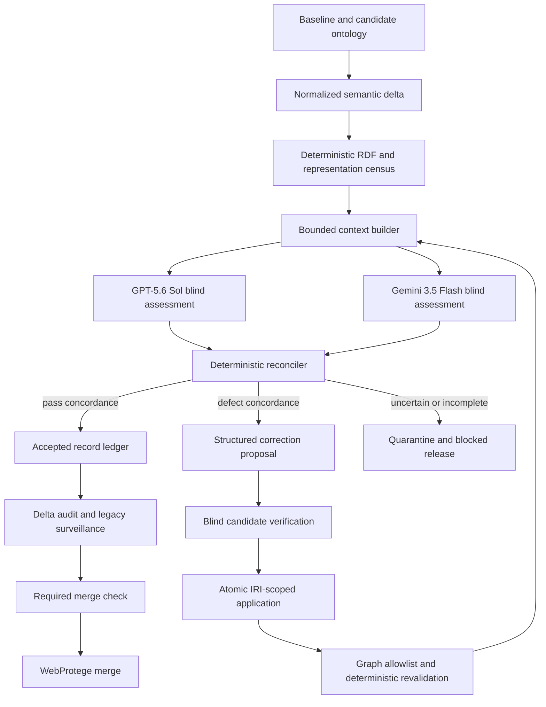
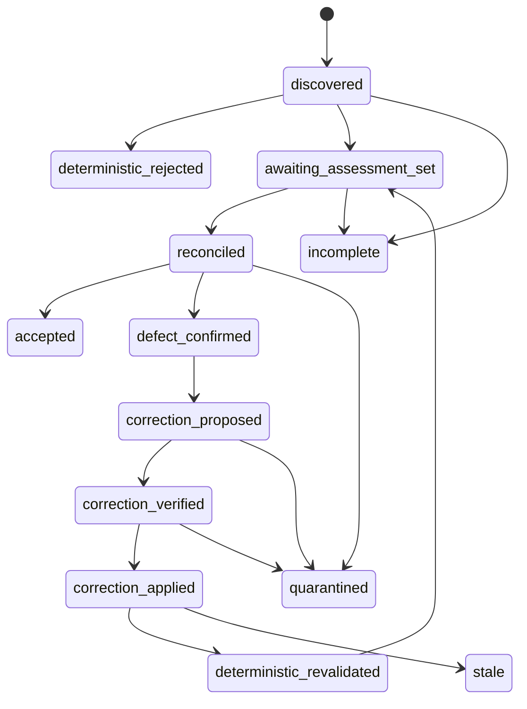

# Automated Ontology Hydration QA - Plan

## Goal Capsule

- **Objective:** Make every FOLIO ontology hydration change pass a reproducible, fully automated legal-semantic QA pipeline before publication.
- **Authority:** This plan may add Python QA modules, schemas, prompts, policies, tests, and GitHub Actions checks. It may change `FOLIO.owl` only through audited, IRI-scoped correction records.
- **Execution profile:** Build deterministic controls first, then measured model review, safe correction, corpus surveillance, and the required merge gate.
- **Stop conditions:** Stop without publishing when inputs are stale, coverage is incomplete, a provider is unavailable, a model abstains or disagrees, a locale is unsupported, a correction is unsafe, an eval regresses, or a budget limit is reached.
- **Tail ownership:** The QA check produces immutable artifacts and a release decision. The existing WebProtege merge runs only after an accepted decision.

---

## Product Contract

### Summary

FOLIO needs an automated QA system that can distinguish new hydration from legacy content, reject structural defects, review legal meaning across languages, correct verified errors safely, and block publication when confidence is insufficient.
The system uses deterministic validation plus blind cross-provider model concordance.
It reports measured automated-review evidence, not a claim of expert legal ground truth.

### Problem Frame

The published ontology contains useful definitions, examples, and translations, but prior audits found literal `NULL` values, empty annotations, serialized containers, incorrect legal definitions, concept-changing translations, and localization counts inflated by unchanged English labels.
The current repository cannot attribute those defects to a hydration batch because it has no delta manifest.
Its existing merge workflow validates XML and RDF syntax after changes reach `main`, which cannot prevent semantically bad hydration from being published.

No expert human reviewers are available.
The replacement must therefore combine task-specific model evaluation, independent provider assessments, strict abstention, immutable evidence, and fail-closed release behavior.

### Requirements

**Hydration identity and provenance**

- R1. Every QA run shall compare immutable baseline and candidate ontology endpoints and emit a versioned semantic hydration manifest.
- R2. Each changed annotation shall have a logical locator plus a content-addressed revision ID that binds subject IRI, predicate, language or datatype, object kind, and canonical before/after hashes with explicit absence sentinels.
- R3. Every append-only stage artifact shall use a canonical envelope with its own hash, run and attempt ID, parent artifact hashes, baseline and candidate byte hashes, policy and tool hashes, and terminal status.
- R4. Serialization-only RDF/XML changes shall not appear as hydration changes.

**Deterministic quality controls**

- R5. Deterministic validation shall inspect 100% of target annotations and 100% of hydration-delta records before semantic review.
- R6. Deterministic failures shall include malformed RDF/XML, invalid RDF, empty or sentinel content, serialized-container leakage, invalid language/datatype combinations, duplicate logical identities, unsupported object kinds, and policy cardinality violations.
- R7. Exact base-label duplication, script mismatch, unusual language tags, and other ambiguous lexical signals shall route records to semantic review unless policy defines a sound deterministic failure.

**Automated semantic review**

- R8. Every changed definition, example, and localized label shall receive blind assessments from the primary and independent provider before acceptance.
- R9. Review inputs shall include bounded, hashed ontology context and a family-specific rubric for definitions, examples, or translations.
- R10. Review outputs shall conform to a closed schema with a terminal verdict, defect taxonomy, evidence spans, preserved legal propositions, rationale, and optional proposed replacement.
- R11. Acceptance shall require complete, schema-valid, high-confidence concordance from provider routes that match the pinned policy identities.
- R12. Disagreement, abstention, refusal, unsupported locale, incomplete output, provider failure, stale input, or exhausted limits shall quarantine the record and block release.
- R13. Model choice shall be governed by held-out task-specific evals. The initial policy uses GPT-5.6 Sol as primary and stable Gemini 3.5 Flash as the blind independent reviewer.

**Correction and release**

- R14. Models shall propose structured correction data only and shall never edit RDF/XML directly.
- R15. A correction shall require two-provider defect agreement, blind verification of the exact candidate replacement, exactly-one-match stale-write protection, and post-edit semantic-diff allowlisting.
- R15a. The correction proposer shall not count toward the two blind verifier votes for its candidate.
- R16. Correction attempts shall be bounded. Repeated candidates, cycles, or a second rejection shall quarantine the record and block release.
- R17. Final success shall require exact record-set completeness, deterministic revalidation, semantic re-review of corrections, a passing hydration-delta audit, and a passing legacy-corpus surveillance gate.
- R18. Whole-corpus surveillance shall use reproducible strata by annotation family, locale, and risk tier, with a census for rare strata and simultaneous statistical bounds for sampled strata.
- R19. The release report shall distinguish deterministic compliance, cross-provider concordance, eval performance, statistical surveillance, and residual model risk. It shall not claim legal ground truth.
- R20. The WebProtege merge artifact shall be verified against the accepted change ledger so stale labels, unaccounted removals, or unrelated graph changes cannot pass through parse validity alone.
- R20a. An offline verifier shall reconstruct the release decision and all correction lineages from a durable content-addressed evidence bundle without provider access.

**CI trust and operations**

- R21. Deterministic checks shall run on every relevant pull request without secrets.
- R22. Model-bearing checks shall never execute untrusted fork code with provider credentials.
- R23. The stable ontology-QA check shall become a required merge check before the existing WebProtege merge can consume a candidate.
- R24. CI tests shall use recorded or stubbed provider responses and shall not spend model tokens.
- R25. Live scans shall use immutable caching, bounded retries, concurrency controls, and explicit cost ceilings; hitting a ceiling shall produce `incomplete`, not reduced coverage.

### Key Flows

- F1. Hydration review
  - **Trigger:** A candidate changes `FOLIO.owl` or a trusted operator supplies baseline and candidate files.
  - **Steps:** Build manifest -> validate census -> assess all changed records twice -> reconcile -> correct verified defects -> revalidate -> run delta and corpus gates.
  - **Outcome:** The candidate receives an accepted or blocked release decision with complete evidence.
  - **Covered by:** R1-R19, R25.

- F2. Trusted CI promotion
  - **Trigger:** A same-repository reviewed commit is ready for the model-bearing check.
  - **Steps:** Verify commit identity -> run secret-bearing QA in a trusted context -> upload evidence -> publish stable required-check result.
  - **Outcome:** Provider secrets never reach untrusted pull-request code.
  - **Covered by:** R21-R25.

- F3. Correction convergence
  - **Trigger:** Both blind reviewers classify a changed record as defective.
  - **Steps:** Propose replacement -> verify replacement twice -> apply atomically -> allowlist graph diff -> reassess corrected record.
  - **Outcome:** The record becomes accepted or terminally quarantined within a bounded number of attempts.
  - **Covered by:** R14-R17.

### Acceptance Examples

- AE1. Covers F1. Given one translation is retagged while sibling `altLabel` values remain, the manifest emits one stable retag or replacement record and no serialization noise.
- AE2. Covers F1. Given a literal `NULL` definition, deterministic validation blocks the run before semantic sampling.
- AE3. Covers F1. Given both providers return concordant passing assessments for every changed record, exact-set completeness succeeds and the run advances.
- AE4. Covers F1. Given one provider omits a record or returns an extra ID, reconciliation marks the run incomplete and blocks release.
- AE5. Covers F3. Given a correction's old-value hash no longer matches, no ontology edit occurs and the record becomes stale.
- AE6. Covers F3. Given a proposed correction would change an unrelated axiom, graph allowlisting rejects the output.
- AE7. Covers F2. Given a fork pull request, deterministic checks run but provider secrets are not exposed; model QA requires a trusted execution against the reviewed commit.
- AE8. Covers F1. Given a rare locale, surveillance uses a census rather than rounding its sample allocation to zero.

### Scope Boundaries

**In scope**

- Fully automated assessment, correction proposal, independent verification, release gating, and audit artifacts.
- One-time correction of defects already confirmed by `docs/2026-07-29-published-content-audit.md` through the new pipeline.
- Provider adapters and policy-based model replacement after held-out evals.
- Deterministic and model-bearing CI flows with a safe secrets boundary.

**Outside this plan**

- A claim that model agreement equals expert legal ground truth.
- Unbounded automatic correction until a model eventually agrees.
- Direct model access to repository write tools, the web, or external tools during record assessment.
- A Claude dependency, default, retry route, or fallback. Any future provider change must pass the same eval and independence requirements.
- Retrofitting the external hydration producer, which is not present in this repository. It may later populate optional provenance fields in the manifest.

---

## Planning Contract

### Key Technical Decisions

- KTD1. **Semantic delta is the pipeline boundary.** Compare baseline and candidate RDF graphs, then emit normalized annotation records. Textual hunks cannot distinguish hydration from serialization.
- KTD2. **SHACL and Python representation checks form the deterministic census.** SHACL owns RDF constraints; raw RDF/XML inspection owns representation defects that graph parsing can erase or normalize.
- KTD3. **All changed semantic records receive two blind reviews.** Sampling cannot satisfy the fail-closed policy for new hydration. Sampling remains a legacy surveillance mechanism.
- KTD4. **GPT-5.6 Sol is the initial primary judge and Gemini 3.5 Flash is the initial independent reviewer.** Both are accessed through provider adapters and remain pinned only while held-out evals support their roles.
- KTD4a. **Benchmark authority is provenance-tiered.** Deterministic mutations are gold; legal-semantic cases require reproducible sources and frozen adjudication and are labeled source-grounded silver; cases without reproducible authority are unscored challenges. Benchmark adjudication routes remain disjoint from production acceptance votes.
- KTD5. **The reconciler, not a model, owns acceptance.** It proves exact ID-set equality, validates provider identity and schemas, and accepts only policy-defined concordance.
- KTD6. **Quarantine blocks release.** The system does not convert uncertainty into acceptance. Legacy quarantines remain visible as uncertified corpus debt.
- KTD7. **Corrections are copy-on-write transactions.** The proposer does not vote on its candidate. Two blind verifier routes must approve it before formatting-preserving XML surgery applies the full batch to a disposable copy. Canonical graph comparison, including blank-node closures, must match the authorized ledger exactly before corrected bytes are published.
- KTD8. **Model confidence is not a gate by itself.** Thresholds use measured held-out performance, deterministic risk signals, evidence completeness, provider concordance, and repeat stability.
- KTD9. **Secrets and untrusted code never share an execution context.** Pull requests run deterministic checks. Model-bearing review runs only against a trusted, immutable commit or through a trusted service receiving normalized data.
- KTD10. **Artifacts are the audit contract.** Each stage consumes immutable predecessor artifacts and emits a versioned successor. A missing artifact means the transition did not occur.
- KTD11. **Acceptance is content-addressed.** A signed or trusted acceptance attestation binds reviewed commit and tree identity, ontology bytes, manifests, policies, prompts, schemas, route qualifications, accepted ledger, report, workflow identity, and run attempt. WebProtege rejects absent, stale, replayed, or mismatched attestations.
- KTD12. **Changed-record and legacy policies are distinct.** Changed records always fail closed. Legacy surveillance follows a frozen expansion policy: severe defects or failed simultaneous bounds expand deterministically to a census, discovered debt enters an append-only ledger, and unresolved debt cannot be described as certified or disappear through resampling.

### High-Level Technical Design

Only fresh `accepted` records contribute to successful hydration coverage.
`deterministic_rejected`, `incomplete`, `stale`, and `quarantined` are non-success terminal states for changed records.

### Sequencing

1. Establish normalized records and semantic delta identity.
2. Add deterministic census checks and fixtures.
3. Freeze the eval corpus, benchmark authority, and model-review policy before live calls.
4. Add blind provider adapters and immutable assessment artifacts.
5. Qualify production, benchmark, proposer, and verifier routes.
6. Add reconciliation, record lineage, verified correction, and graph allowlisting.
7. Add orchestration and offline evidence replay.
8. Add whole-corpus surveillance and the confirmed-defect migration.
9. Add the trusted required check and content-addressed WebProtege handoff.

---

## Implementation Units

### U1. Normalized Records and Hydration Delta

- **Goal:** Create the immutable semantic contract that identifies exactly what hydration changed.
- **Requirements:** R1-R4.
- **Dependencies:** None.
- **Files:**
  - Create `scripts/ontology_qa/__init__.py`.
  - Create `scripts/ontology_qa/records.py`.
  - Create `scripts/ontology_qa/delta.py`.
  - Create `scripts/generate_hydration_delta.py`.
  - Create `schemas/hydration-delta.schema.json`.
  - Create `tests/test_hydration_delta.py`.
  - Create `tests/fixtures/ontology/`.
- **Approach:**
  1. Normalize annotations across all RDF subjects, not only `owl:Class` blocks.
  2. Preserve object kind, datatype, canonical language tag, lexical value, and stable hashes.
  3. Pair removed and added literals under a versioned replacement policy without assuming predicates are single-valued.
  4. Emit added, removed, retagged, and replaced records plus unrelated semantic drift.
- **Patterns to follow:** Reuse the semantic graph comparison and explicit CLI failure style from `scripts/generate_webprotege_merge.py`.
- **Test scenarios:**
  - Add, remove, retag, and replace a translation while sibling labels remain; each produces the intended record class.
  - Reorder RDF/XML and blank nodes without semantic change; the delta remains empty.
  - Change Unicode normalization or whitespace according to policy; identity and classification remain deterministic.
  - Create two candidates with the same logical locator but different new values; revision IDs and cache keys differ.
  - Supply mismatched Git SHA and file hash metadata; generation fails.
  - Compare multi-valued definitions or labels; no value is paired or overwritten ambiguously.
- **Verification:** The same immutable inputs produce byte-stable manifest identity and every changed annotation maps to one unambiguous record.

### U2. Deterministic Annotation Census

- **Goal:** Reject structural and representation defects before any model call or sample construction.
- **Requirements:** R5-R7.
- **Dependencies:** U1.
- **Files:**
  - Create `scripts/ontology_qa/validators.py`.
  - Create `scripts/validate_ontology_annotations.py`.
  - Create `qa/ontology/shapes.ttl`.
  - Create `qa/ontology/review-policy.yaml`.
  - Create `tests/test_annotation_validators.py`.
  - Modify `scripts/requirements.txt`.
- **Approach:**
  1. Validate the raw XML representation and the parsed RDF graph.
  2. Run SHACL constraints for graph-level invariants.
  3. Emit deterministic failures separately from semantic-review risk signals.
  4. Validate the full target population before selecting any legacy audit sample.
- **Execution note:** Start with fixtures for the defects already observed in `FOLIO.owl`.
- **Test scenarios:**
  - Empty, whitespace-only, and literal `NULL` definitions fail.
  - Serialized Python-list labels and invalid BCP 47 tags fail.
  - Resource-valued annotations follow explicit predicate policy.
  - Duplicate regional/base labels and script mismatches route to semantic review when they may be legitimate.
  - Duplicate logical record IDs, bad Unicode, missing subjects, and cardinality violations fail.
  - A malformed annotation cannot disappear from population counts.
- **Verification:** The census accounts for every in-scope annotation and reproduces the known mechanical defects without false acceptance.

### U3. Eval Corpus, Rubrics, and Model Policy

- **Goal:** Define measurable evidence for selecting and changing automated reviewers.
- **Requirements:** R8-R13, R19, R25.
- **Dependencies:** U1, U2.
- **Files:**
  - Create `qa/ontology/evals/cases.jsonl`.
  - Create `qa/ontology/evals/held-out.jsonl`.
  - Create `qa/ontology/prompts/definition-review.md`.
  - Create `qa/ontology/prompts/example-review.md`.
  - Create `qa/ontology/prompts/translation-review.md`.
  - Create `qa/ontology/model-policy.yaml`.
  - Create `schemas/ontology-review.schema.json`.
  - Create `scripts/ontology_qa/evals.py`.
  - Create `tests/test_model_evals.py`.
- **Approach:**
  1. Freeze known clean cases, confirmed defects, deterministic cases, and locale/family slices.
  2. Add mutation cases for negation, modality, party, number, jurisdiction, concept substitution, untranslated text, bad register, and prompt-injection-like literals.
  3. Keep the final release set held out and prevent model-generated consensus from entering gold data automatically.
  4. Separate deterministic-gold, source-grounded-silver, and unscored challenge cases with provenance and leakage controls.
  5. Define qualification thresholds and artifact schemas here; run live route qualification after provider adapters exist.
- **Test scenarios:**
  - Deterministic-gold and source-grounded-silver cases retain their provenance tier and unscored challenges do not affect accuracy denominators.
  - A prompt, rubric, schema, reasoning, or model change invalidates prior qualification until evals rerun.
  - An eval case containing instructions inside ontology text is treated only as data.
  - A locale/family without sufficient measured support becomes unsupported and fail-closed.
  - A generated correction cannot be promoted into the held-out set by model agreement alone.
- **Verification:** The eval corpus, authority tiers, rubrics, thresholds, and qualification-artifact contract are frozen and content-addressed.

### U4. Blind Provider Review and Reconciliation

- **Goal:** Implement provider-neutral blind assessment ports and immutable provider-result artifacts.
- **Requirements:** R8-R13, R25.
- **Dependencies:** U1-U3.
- **Files:**
  - Create `scripts/ontology_qa/context.py`.
  - Create `scripts/ontology_qa/providers/base.py`.
  - Create `scripts/ontology_qa/providers/openai.py`.
  - Create `scripts/ontology_qa/providers/google.py`.
  - Create `scripts/ontology_qa/model_review.py`.
  - Create `scripts/ontology_qa/reconcile.py`.
  - Create `scripts/ontology_qa/state.py`.
  - Create `tests/test_model_review.py`.
  - Create `tests/test_reconciliation.py`.
  - Create `tests/fixtures/model_responses/`.
  - Modify `scripts/requirements.txt`.
- **Approach:**
  1. Build compact, hashed context with the concept label, annotation, relevant ancestors, selected siblings, locale, and deterministic risk evidence.
  2. Dispatch blind assessments without exposing one provider's answer to the other.
  3. Validate actual model identity, schema, evidence, record IDs, and retry history.
  4. Keep provider-specific SDK types behind adapters and publish only normalized result artifacts.
  5. Cache only immutable input, context, prompt, schema, policy, qualification, and actual-model identities.
- **Test scenarios:**
  - Blind routes receive identical immutable inputs without seeing peer outputs.
  - Valid JSON that omits, duplicates, truncates, or invents record IDs fails completeness.
  - A route returns an unpinned model identity; the run fails without substitution.
  - A transient 429 retries the same immutable request; exhaustion becomes incomplete.
  - Budget or deadline exhaustion does not reduce coverage.
  - A newer candidate hash invalidates cached assessments and marks the run stale.
  - Policy contains no Claude route, alias, retry, or fallback.
- **Verification:** Both adapters produce schema-valid, identity-bound artifacts through one provider-neutral contract and never substitute an unconfigured route.

### U11. Route Qualification and Independence

- **Goal:** Qualify each production, benchmark-adjudication, correction-proposer, and correction-verifier role before it can contribute to a release.
- **Requirements:** R8-R13, R15a, R19.
- **Dependencies:** U3, U4.
- **Files:**
  - Create `scripts/ontology_qa/qualification.py`.
  - Create `schemas/model-qualification.schema.json`.
  - Create `tests/test_model_qualification.py`.
- **Approach:**
  1. Run the frozen eval suite against actual pinned model identities and reasoning settings.
  2. Emit a content-addressed qualification artifact binding route, role, provider/model receipt, prompts, schemas, eval set, metrics, and thresholds.
  3. Enforce route separation between benchmark adjudication and production votes, and between a correction proposer and its two verifiers.
  4. Reject route aliases, family fallbacks, or model mismatches.
- **Test scenarios:**
  - Qualified routes meet every per-family and per-locale threshold and publish a reusable immutable artifact.
  - Changing model, prompt, rubric, schema, reasoning, eval set, or threshold invalidates the qualification.
  - A production reviewer cannot also provide benchmark authority for the same case.
  - A correction proposer cannot occupy either verifier slot.
  - A missing, expired-by-policy, or mismatched qualification blocks assessment.
- **Verification:** Reconciliation and correction accept only results carrying valid role-specific qualification hashes.

### U5. Verified Correction and Graph Allowlisting

- **Goal:** Convert concordant defects into safe, bounded, auditable ontology corrections.
- **Requirements:** R14-R17.
- **Dependencies:** U1, U2, U4, U11.
- **Files:**
  - Create `scripts/ontology_qa/corrections.py`.
  - Create `scripts/apply_ontology_corrections.py`.
  - Create `schemas/ontology-correction.schema.json`.
  - Create `tests/test_correction_application.py`.
  - Add characterization tests for `scripts/generate_webprotege_merge.py`.
- **Approach:**
  1. Generate structured candidates only after both reviewers agree a defect exists.
  2. Create a new content-bound correction revision in the immutable root-record lineage.
  3. Ask two qualified blind verifier routes, excluding the proposer, to verify the exact candidate.
  4. Apply the complete verified batch to a disposable copy through atomic locators with exactly-one-match and old-hash protection.
  5. Publish no corrected bytes until raw XML checks, canonical graph isomorphism, and ledger allowlisting all pass.
  6. Preserve the pre-correction candidate for rollback; a rollback is a new candidate that must pass the full gate.
- **Execution note:** Characterize existing merge behavior before extracting or reusing XML-surgery helpers.
- **Test scenarios:**
  - An exact verified replacement applies once and emits a complete ledger.
  - Zero matches, multiple matches, or changed old hash perform no mutation.
  - A correction that changes an axiom, relationship, sibling annotation, or unrelated record is rejected.
  - A repeated proposal or correction cycle reaches quarantine within the configured bound.
  - Failure before, during, or after any correction leaves the tracked candidate byte-identical and publishes no partial output.
  - Blank-node restrictions, axiom annotations, headers, imports, and non-class subjects remain invariant unless explicitly authorized.
  - Escaping and language/datatype preservation round-trip correctly.
  - The corrected record re-passes deterministic and dual-provider review.
- **Verification:** Every ontology edit is traceable to an accepted correction record and the graph diff contains no unauthorized change.

### U6. Artifact Orchestration and Offline Replay

- **Goal:** Enforce artifact-backed transitions, correction lineage closure, release decisions, and offline evidence verification.
- **Requirements:** R3, R12, R17, R19, R20a, R25.
- **Dependencies:** U1-U5, U11.
- **Files:**
  - Create `scripts/ontology_qa/reporting.py`.
  - Create `scripts/ontology_qa/replay.py`.
  - Create `scripts/run_ontology_hydration_qa.py`.
  - Create `schemas/ontology-qa-report.schema.json`.
  - Create `tests/test_hydration_qa_pipeline.py`.
  - Create `tests/test_evidence_replay.py`.
- **Approach:**
  1. Orchestrate manifest, census, semantic review, correction, revalidation, delta audit, and corpus surveillance as artifact-backed transitions.
  2. Snapshot all path inputs by content and publish append-only artifacts atomically after validation.
  3. Fence reconciliation, correction publication, release decisions, check updates, and handoffs against current commit, tree, ontology, policy, and parent hashes.
  4. Reconcile final delta revisions, provider results, terminal states, correction lineages, and accepted ledger exactly.
  5. Let an offline verifier reconstruct the decision and detect tampered, missing, reordered, partial, or overwritten artifacts.
- **Test scenarios:**
  - A fully concordant run reaches `merge_gate_passed` with all artifacts present.
  - Any skipped stage, missing artifact, quarantined changed record, or incomplete provider job blocks.
  - Identical runs reuse only compatible cache entries and preserve selected sample IDs.
  - A source mutated mid-run, delayed provider response, or older workflow attempt becomes stale and cannot update authority pointers.
  - Tampered parents, partial writes, correction-lineage gaps, and final-delta mismatches fail offline replay.
  - The report never labels automated concordance as legal certification.
- **Verification:** One command can replay the complete workflow locally against fixtures and produce a schema-valid, self-consistent release report.

### U8. Legacy Surveillance and Statistical Policy

- **Goal:** Monitor unchanged corpus debt reproducibly without weakening the hard gate for changed records.
- **Requirements:** R18, R19, R25.
- **Dependencies:** U1-U4, U6, U11.
- **Files:**
  - Create `scripts/ontology_qa/sampling.py`.
  - Create `tests/test_stratified_sampling.py`.
- **Approach:**
  1. Freeze strata, seeds, minimum samples, rare-stratum census rules, simultaneous bounds, expansion rules, severity thresholds, and stopping rules before observing results.
  2. Persist selected record IDs so execution order or retries cannot resample toward acceptance.
  3. Add every discovered defect to the append-only debt ledger.
  4. Expand a failed stratum deterministically up to census; budget exhaustion stays blocked.
- **Test scenarios:**
  - Rare locales are censused and never disappear through rounding.
  - Severe defects and failed bounds produce identical expansion decisions across replay order.
  - Changing population or policy invalidates prior samples; retries against the same inputs preserve IDs.
  - A defect cannot disappear through a new seed, population shrink, or interrupted expansion.
- **Verification:** Legacy surveillance has a reproducible evidence trail and cannot certify unresolved or statistically hidden debt.

### U9. Confirmed-Defect Migration

- **Goal:** Process the already confirmed ontology defects as the first bounded data-only consumer of the qualified pipeline.
- **Requirements:** R14-R20.
- **Dependencies:** U5, U6, U8, U11.
- **Files:**
  - Create `qa/ontology/confirmed-defects.json`.
  - Create `tests/test_confirmed_defect_migration.py`.
- **Approach:**
  1. Record exact locators, current hashes, defect classes, discovery provenance, and open lifecycle state without treating proposed replacements as gold.
  2. Apply the same proposal, blind verification, copy-on-write correction, graph allowlist, lineage, and final-gate rules used for hydration.
  3. Reconcile every open and closed debt item against final ontology bytes and the durable evidence bundle.
- **Test scenarios:**
  - Stale hashes, missing targets, duplicate matches, and interrupted batches leave all affected debt open and publish no partial ontology.
  - Known defects cannot vanish because the audit sample or seed changes.
  - Rollback restores the retained predecessor and leaves debt entries open until a new candidate passes.
- **Verification:** The confirmed debt migration is atomic, replayable, and independent of reusable pipeline fixtures.

### U7. Trusted Required Check and Acceptance Attestation

- **Goal:** Prevent semantically unaccepted hydration from reaching the published merge artifact.
- **Requirements:** R20-R25.
- **Dependencies:** U1-U6, U8, U9, U11.
- **Files:**
  - Create `.github/workflows/ontology-hydration-qa.yml`.
  - Create `tests/test_workflow_contract.py`.
  - Update `README.md`.
- **Approach:**
  1. Run deterministic checks on every relevant pull request.
  2. Run model-bearing review only against a trusted immutable commit with provider credentials.
  3. Reject `pull_request_target` plus untrusted checkout and document the trusted-dispatch path for fork contributions.
  4. Cancel stale runs per ref and verify hashes before publishing a check result.
  5. Upload evidence artifacts even on failure.
  6. Publish a durable content-addressed attestation that binds the exact reviewed ontology bytes and complete evidence bundle.
- **Execution note:** Integrate the hard gate after local and fixture-backed replay is deterministic so the repository does not acquire an irrecoverably red or token-spending check.
- **Test scenarios:**
  - Same-repository trusted commit runs model QA and publishes the stable required-check name.
  - Fork PR code cannot access provider secrets or run in a privileged context.
  - A stale commit cannot publish success for a newer candidate.
  - Failure uploads the manifest, deterministic findings, provider receipts, ledger, report, and logs without leaking secrets.
  - An older run cannot update the required check or accepted-attestation pointer after a newer commit.
- **Verification:** Branch protection can require one stable fail-closed check whose success is bound to exact ontology and evidence hashes.

### U10. Attested WebProtege Handoff

- **Goal:** Ensure the derived WebProtege artifact consumes exactly the ontology bytes accepted by U7.
- **Requirements:** R20-R23.
- **Dependencies:** U7.
- **Files:**
  - Modify `.github/workflows/webprotege-merge.yml`.
  - Create `tests/test_webprotege_attestation.py`.
- **Approach:**
  1. Resolve the acceptance attestation for the exact `FOLIO.owl` content hash.
  2. Verify workflow identity, run attempt, reviewed commit/tree, policy, qualification, ledger, report, and evidence-bundle digests.
  3. Reject absent, stale, replayed, mismatched, or expired evidence.
  4. Generate the merge artifact and prove canonical graph fidelity against the accepted ledger.
- **Test scenarios:**
  - Merge refuses an attestation for a different merge commit, ontology hash, policy, or workflow attempt.
  - Tampered or missing evidence bundles fail offline replay before generation.
  - Generated output contains all accepted changes, no stale removed labels, and no unrelated semantic changes.
  - A rollback restores the retained predecessor, regenerates output, and passes the same attestation and replay gates.
- **Verification:** WebProtege output is reproducibly tied to the durable accepted release bundle, not merely a check name or expiring CI artifact.

---

## Verification Contract

| Gate | Applies to | Required outcome |
|---|---|---|
| Schema and unit suite | All U-IDs | All schemas, fixtures, state transitions, adapters, and correction tests pass without live API calls |
| Delta replay | U1, U6 | Manifest is stable, complete, serialization-insensitive, and bound to immutable endpoints |
| Deterministic census | U2, U5, U6 | Zero unresolved deterministic violations in the release candidate |
| Held-out model eval | U3, U4, U11 | Every role-specific pinned route meets per-family and per-locale policy thresholds with authority and leakage controls |
| Review completeness | U4, U6 | Manifest IDs equal both provider result sets and terminal state IDs |
| Correction safety | U5 | Every mutation is copy-on-write with exact locator, proposer-excluded dual verification, lineage, ledger, and canonical allowlisted graph diff |
| Evidence replay | U6 | Offline replay verifies every artifact edge, terminal state, lineage, ontology byte hash, and report decision |
| Delta semantic gate | U6 | Every changed record is fresh and accepted; none is quarantined, incomplete, stale, or unsupported |
| Legacy surveillance | U8 | Every required stratum is censused or sampled reproducibly and follows its frozen expansion policy |
| Confirmed-debt migration | U9 | Every debt item is open or closed against matching ontology bytes with no partial batch |
| CI trust boundary | U7 | No untrusted code executes with provider secrets; stale runs cannot report success |
| WebProtege fidelity | U10 | Derived graph matches the content-addressed attestation and accepted ledger |

---

## Risks and Dependencies

- **No human gold authority:** Cross-provider concordance can still be jointly wrong. Mitigate with task-specific held-out evals, mutation tests, source/context evidence, provider independence, abstention, and conservative claims.
- **Provider drift:** Model aliases and behavior can change. Persist actual identities and force requalification after any provider, model, prompt, rubric, schema, or reasoning change.
- **Locale capability gaps:** Some language/family pairs may remain unsupported. Quarantine them and block changed records rather than claiming coverage.
- **Cost growth:** Full dual review of large deltas can be expensive. Apply deterministic filters, immutable caching, bounded contexts, batch APIs, concurrency limits, and explicit incomplete outcomes at caps.
- **Legacy corpus debt:** The first corpus census may reveal many blockers. Keep changed-record gating strict and surface legacy debt as uncertified until the bounded correction pipeline resolves it.
- **Audit retention:** Expiring GitHub Actions artifacts cannot be the sole evidence store. Retain content-addressed release bundles for the ontology's audit lifetime and test offline replay and rollback.
- **CI secret safety:** GitHub workflow design alone does not make a check required. Repository administrators must configure branch protection after the stable check exists.

---

## Sources and Research

- Existing patterns: `scripts/generate_webprotege_merge.py`, `.github/workflows/webprotege-merge.yml`, `scripts/requirements.txt`.
- Prior audits: `docs/2026-07-29-published-content-audit.md`, `docs/PART-D-folio-data-cleanup.md`.
- W3C SHACL Recommendation: <https://www.w3.org/TR/shacl/>.
- BCP 47 / RFC 5646 language tags: <https://www.rfc-editor.org/rfc/rfc5646>.
- OpenAI model and evaluation guidance: <https://developers.openai.com/api/docs/models>, <https://developers.openai.com/api/docs/guides/evaluation-best-practices>.
- OpenAI Structured Outputs: <https://developers.openai.com/api/docs/guides/structured-outputs>.
- Google model and deprecation references: <https://ai.google.dev/gemini-api/docs/models>, <https://ai.google.dev/gemini-api/docs/deprecations>.
- NIST Generative AI Profile: <https://doi.org/10.6028/NIST.AI.600-1>.

---

## Definition of Done

- Every R-ID is implemented or explicitly rejected by a documented scope change.
- Every U-ID meets its verification outcome and all applicable gates in the Verification Contract pass.
- The repository contains versioned delta, review, correction, report, prompt, policy, and eval schemas or artifacts.
- The held-out eval qualifies the pinned primary and independent provider routes for every required annotation family and locale.
- Every changed semantic record receives complete blind assessments and ends fresh in `accepted`.
- No changed record ends quarantined, incomplete, stale, unsupported, or deterministically rejected.
- Every applied correction has dual verification, exact stale-write protection, an immutable ledger, and an allowlisted graph diff.
- Every correction batch is copy-on-write and all-or-nothing; the proposer is excluded from both verifier votes.
- Every route that contributes to acceptance carries a current role-specific qualification artifact with benchmark authority provenance.
- The confirmed ontology defects are processed through the new pipeline and the resulting candidate passes deterministic, delta, and corpus gates.
- The required CI check protects the reviewed commit without exposing provider secrets to untrusted code.
- WebProtege merge output is semantically tied to the accepted ledger.
- A durable content-addressed bundle supports offline replay of the release decision and restoration of the retained predecessor.
- Reports state automated evidence and residual model risk without claiming expert legal certification.
- Documentation explains local replay, trusted model execution, policy changes, provider qualification, artifacts, costs, and blocked-run diagnosis.
- Dead-end experiments, unused provider routes, stale prompt versions, temporary correction files, and abandoned code are removed from the final diff.
